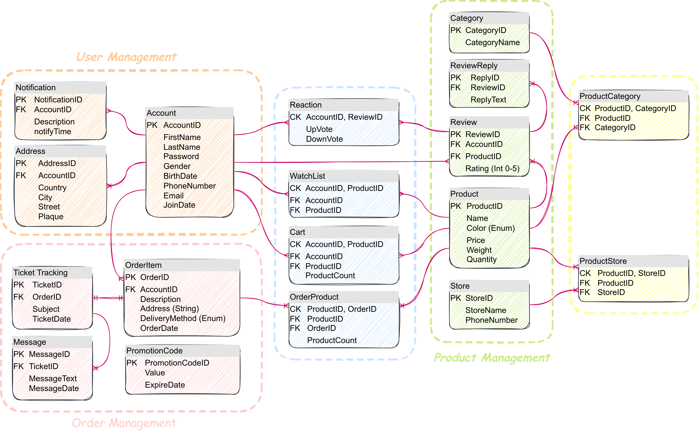

# E-commerce Management System

This project was designed by the TA team for the Database Design Principles course (Spring 2022).

## Description

### Overview
You should design and develop an e-commerce management system. The user interacts
with the system through a user interface (UI). This interface can either be a graphical (GUI)
or command-line (CLI) interface. In addition, an API should be implemented to facilitate the
connection between the UI and the system database.

### Specifications
Users, products, orders, and admins are the core elements of the system. There are N
different products and a set of defined product categories. Each product may be associated
with multiple categories. A product may be available in several stores. The stores update
the system about the availability of the products on a daily basis. Users can watch
out-of-stock products and when they become available the user is notified.

A user can search a product by title. The list of products can be filtered by various features
such as price range and specific product types. Products can be sorted based on the
highest and lowest price, rating, and the date they were added to the system. Similar
products are shown to the user when he is viewing a product’s page and details.

A user can order several products and request to send them to one of his addresses by
various delivery methods such as air express. Also, tracking the order status and current
location is possible. A user can apply a promotion code to his order. If the order is delayed
or damaged upon arrival, the user can contact support and open a ticket for tracking the
problem. Users can review and rate the products they have ordered. Other users can
upvote or downvote these reviews.

### Requirements
All the queries of your program must be written in raw SQL. You are free to implement
your program in any programming language that has a SQL driver. ORM frameworks are
prohibited to use.

To develop your program and avoid any system-specific dependencies, your project and
SQL database must be containerized using Docker. In addition, all the project progress and
contributions must be recorded via commits in git repositories.

You are free to design and implement a graphical user interface or a comprehensive
command-line interface for users to interact with the system. Note that having an interface
is essential as the evaluation is based on examining the features via such interface.


## Implementation

### Database Design


### How to Run

#### Back-End
Download Docker Desktop for Mac or Windows. Docker Compose will be automatically installed. 
On Linux, make sure you have the latest version of Compose.

To run the application enter:
```
docker-compose up
```

And to stop the whole application:
```
docker-compose down
```

#### GUI
First the python and its dependencies should be installed:
 - Tkinter -> the GUI library
 - Networks -> for https requests to the back-end

In order to run the application enter:
```
python3 main.py
```

## Used Technologies

### Docker
Docker was used extensively to fully containerize the whole web app, including the front-end and back-end. All technologies used in this project run in their
own container and talk to each other on isolated networks. In addition to said features, using Docker eases managing the dependencies and running the project
as a stand-alone application in production and development environments. All the following technologies were dockerized and managed into a single solution by
the help of Docker Compose. 

### Gin (Golang)
Gin, which is a back-end framework written in Golang, was used to develop the REST API of web app. Certain design patterns were used while developing the APIs to ensure
that the database is abstract as seen from the controllers. In order to authorize and authenticate the credentials, JWT was employed. 

### PostgreSQL
PostgreSQL  is used as the relational DBMS of the application.

### Redis
Redis, which is a light in-memory database, is used to store the temporary information, such as user authorization tokens.
